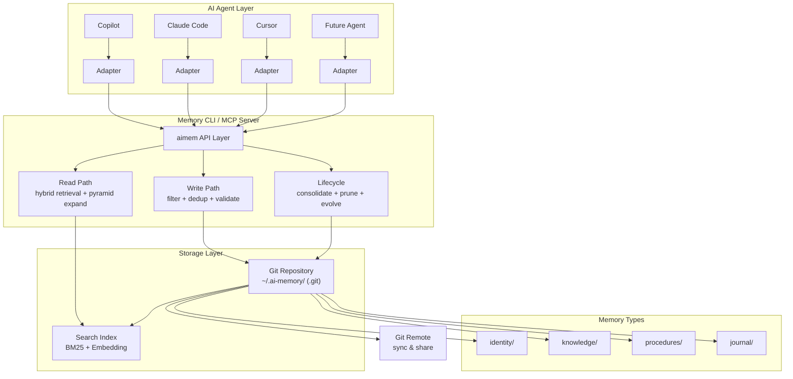
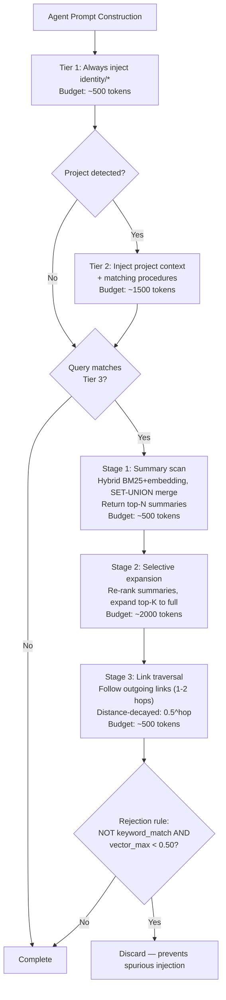
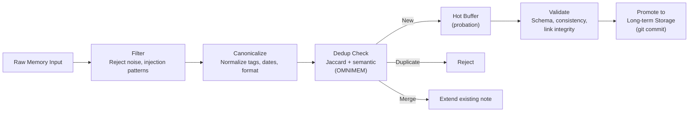
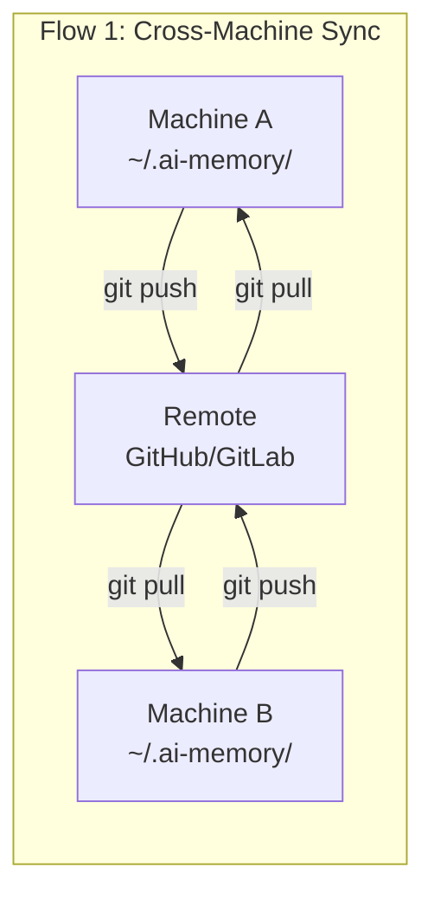
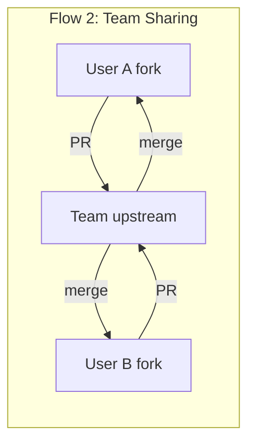
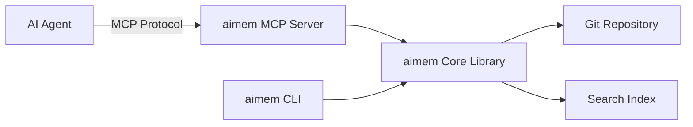

# AI Agent Memory System Design

## Git-Based Shared Memory for Local AI Agents

*Design informed by: A-MEM (NeurIPS 2025), MIRIX, MemGPT, H-MEM (EACL 2026),
Intrinsic Memory Agents, Von Neumann for LLM, ABF Forgetting, OMNIMEM,
EPOS-VLM, Autogenesis Protocol, Agent Memory Below the Prompt, Memory for
Autonomous LLM Agents (Survey), Memory Poisoning Attack/Defense, and Memori.*
*14 papers analyzed across 3 research iterations. Readiness: IMPLEMENTATION_READY.*

---

## 1. Problem Statement

Local AI coding agents (GitHub Copilot, Claude Code, future agents) lack a
unified, persistent memory system that:

- **Survives across sessions** — agents lose context between conversations
- **Shares across machines** — preferences set on one computer don't transfer
- **Shares across people** — team conventions aren't portable
- **Works with multiple agents** — each agent has its own proprietary format
- **Stays local-first** — sensitive project context shouldn't leave the machine
- **Evolves over time** — knowledge should be refined, not just accumulated
- **Resists poisoning** — shared memory repos must defend against malicious injection

## 2. Research Foundation

### Key Insights from Literature

| Paper | Key Contribution | Applied Here |
|-------|-----------------|--------------|
| **A-MEM** (arXiv:2502.12110) | Zettelkasten-inspired atomic notes with dynamic linking and memory evolution | Note structure, linking system, evolution mechanism |
| **MIRIX** (arXiv:2507.07957) | Six memory types: Core, Episodic, Semantic, Procedural, Resource, Knowledge Vault | Memory type taxonomy (simplified to 4) |
| **MemGPT** (arXiv:2310.08560) | OS-inspired tiered storage: main context (RAM) vs external (disk) | Hot/warm/cold tier model for context injection |
| **H-MEM** (EACL 2026) | Hierarchical multi-level semantic abstraction with index-based routing | Directory hierarchy as natural abstraction layers |
| **Intrinsic Memory Agents** (arXiv:2508.08997) | Agent-specific structured memory with generic templates | Agent adapter layer |
| **Von Neumann for LLM** (arXiv:2504.04485) | Computer architecture analogy for systematic agent design | Modular architecture |
| **ABF Forgetting** (arXiv:2604.02280) | Adaptive Budgeted Forgetting: $I(m,t) = \alpha \cdot R + \beta \cdot F + \gamma \cdot S$ | Forgetting policy scoring formula, type-specific weights |
| **OMNIMEM** (arXiv:2604.01007) | SOTA retrieval via pyramid expansion, hot/cold storage, set-union hybrid, Jaccard dedup | Pyramid retrieval, ingestion dedup, set-union merge, summary field, token budgets |
| **EPOS-VLM** (arXiv:2603.24257) | Episodic object memory with frequency-weighted observations, explicit entity resolution | Observation counting, entity resolution for links, structured text sufficiency |
| **Autogenesis** (arXiv:2604.15034) | Self-evolving agent protocol with 16-operator Context Manager API for resource lifecycle | CLI/MCP operator template, contract generation for context injection |
| **Agent Memory Below the Prompt** (arXiv:2603.04428) | Persistent Q4 KV cache with tiered hot/warm/cold hierarchy on edge devices | Tiered architecture validation; text memory survives model swaps |
| **Memory for Autonomous LLM Agents** (arXiv:2603.07670) | Survey: POMDP write-manage-read loop, 4 benchmarks, Self-RAG gating, dual-buffer consolidation | Benchmarks, write-path checklist, causal metadata, consolidation patterns |
| **Memory Poisoning Attack/Defense** (arXiv:2601.05504) | Memory density dilutes attacks (ASR 62% to 6%); LLM self-validation fails for security | Defense-in-depth security model, retrieval window limits |
| **Memori** (arXiv:2603.19935) | Dual-representation (triples + summaries); 82% accuracy at 5% token cost (1,294 tokens/query) | Token efficiency benchmark, dual-representation validated, hybrid retrieval confirmed |

### Design Principles Extracted

1. **Atomic notes** — each memory is a self-contained, addressable unit (Zettelkasten / A-MEM)
2. **Type differentiation** — separate what you know, how you work, what happened (MIRIX)
3. **Tiered access** — not all memories belong in active context (MemGPT, Agent Memory Below the Prompt)
4. **Hierarchical organization** — abstract upward, detail downward (H-MEM)
5. **Dynamic linking** — connections emerge from content, not predefined schemas (A-MEM)
6. **Memory evolution** — memories refine and consolidate over time (A-MEM)
7. **Agent-agnostic storage** — one source of truth, multiple consumers; text survives model swaps (this design, Agent Memory Below the Prompt)
8. **Pyramid retrieval** — load summaries first, expand selectively within token budget (OMNIMEM)
9. **Hybrid search** — combine dense (embedding) + sparse (BM25) with set-union merging (OMNIMEM, Memori)
10. **Ingestion quality** — deduplicate before storage, not just during retrieval (OMNIMEM)
11. **Type-aware forgetting** — prune by scoring formula with type-specific weights (ABF)
12. **Correctness over sophistication** — bug fixes > architecture > tuning (OMNIMEM meta-finding)
13. **Dual-buffer consolidation** — hot buffer with probation before long-term promotion (Memory Survey)
14. **Defense in depth** — memory density, git provenance, retrieval window limits; never LLM self-validation (Memory Poisoning)
15. **Memory as structuring, not storage** — pre-structure at write time for 20x token reduction (Memori)

## 3. Architecture Overview



## 4. Memory Types (Simplified from MIRIX's 6 to 4)

Informed by MIRIX's six-type taxonomy, simplified for practical code-agent use:

### 4.1 Identity (`identity/`)

*What: Core persistent facts about the user and their preferences.*

Analogous to MIRIX's **Core Memory**. Rarely changes. Always loaded into agent
context (MemGPT's "main context" tier).

```
identity/
├── profile.md          # Name, role, org, communication style
├── preferences.md      # Language, formatter, linter, editor settings
├── environment.md      # OS, shell, package managers, tool versions
└── principles.md       # Coding philosophy, quality standards
```

**Example note** (`identity/preferences.md`):
```yaml
---
type: identity
tags: [python, formatting, tooling]
updated: 2026-04-03
confidence: high
summary: "Python 3.12+ with isort+black formatter, ruff linter, pytest, uv"
---
# Python Development Preferences

- Language: Python 3.12+
- Formatter: isort + black (line-length 88)
- Linter: ruff (linting only)
- Type checker: mypy
- Test framework: pytest + tox
- Package manager: uv
- Docstrings: Google style
- Error variable: `exc` (not `e`)
```

### 4.2 Knowledge (`knowledge/`)

*What: Domain facts, technical knowledge, project conventions.*

Combines MIRIX's **Semantic Memory** and **Knowledge Vault**. Organized
hierarchically (H-MEM principle). Loaded on-demand based on relevance.

```
knowledge/
├── languages/
│   ├── python.md
│   ├── typescript.md
│   └── rust.md
├── frameworks/
│   ├── fastapi.md
│   ├── react.md
│   └── pydantic.md
├── tools/
│   ├── git.md
│   ├── docker.md
│   └── pre-commit.md
├── domains/
│   ├── web-security.md
│   └── data-pipelines.md
└── projects/
    ├── arxiv-paper-pipeline.md
    ├── luminote.md
    └── routeros-mcp.md
```

### 4.3 Procedures (`procedures/`)

*What: How-to recipes, workflows, command patterns.*

Maps to MIRIX's **Procedural Memory**. Actionable knowledge that agents can
follow directly.

```
procedures/
├── workflows/
│   ├── uv-managed-project.md
│   ├── pre-commit-setup.md
│   ├── tdd-workflow.md
│   └── code-review.md
├── commands/
│   ├── git-common.md
│   ├── python-debug.md
│   └── docker-recipes.md
├── patterns/
│   ├── error-handling.md
│   ├── logging-setup.md
│   └── pydantic-models.md
└── troubleshooting/
    ├── arxiv-api-issues.md
    ├── pipx-session-lock.md
    └── pre-commit-failures.md
```

### 4.4 Journal (`journal/`)

*What: Episode logs, session summaries, decisions and their rationale.*

Maps to MIRIX's **Episodic Memory**. Time-ordered records that provide context
for why things are the way they are.

```
journal/
├── sessions/
│   ├── 2026-04-03-arxiv-pipeline-bugfixes.md
│   └── 2026-04-02-mcp-server-implementation.md
├── decisions/
│   ├── 2026-04-03-memory-system-design.md
│   └── 2026-03-15-chose-uv-over-poetry.md
├── incidents/
│   ├── 2026-04-03-arxiv-rate-limit-hit.md
│   └── 2026-03-20-docling-model-download-slow.md
└── learnings/
    ├── 2026-04-03-pipx-session-lock.md
    └── 2026-03-25-defusedxml-lxml-migration.md
```

## 5. Note Structure (A-MEM Inspired)

Every memory note follows a standardized structure inspired by A-MEM's
Zettelkasten-derived note format:

```yaml
---
# Required frontmatter
type: identity | knowledge | procedure | journal
tags: [tag1, tag2, ...]          # For categorization and retrieval
updated: YYYY-MM-DD              # Last modification date
summary: "One-line summary"      # For pyramid retrieval Stage 1 (OMNIMEM)

# Optional frontmatter
confidence: high | medium | low  # How reliable is this memory
links: [path/to/related.md, ...] # Explicit connections (A-MEM links)
supersedes: path/to/old.md       # Memory evolution tracking
project: project-name            # Project scope
agent: copilot | claude | all    # Agent-specific memory (default: all)
machine: hostname                # Machine-specific memory
date: YYYY-MM-DD                 # For journal entries

# Causal metadata (Memory Survey — optional, Phase 2+)
caused_by: path/to/cause.md     # What led to this memory
causes: [path/to/effect.md]     # What this memory influences

# Observation tracking (EPOS-VLM)
observation_count: 0             # Times this fact independently observed
first_observed: YYYY-MM-DD      # When first encountered
last_observed: YYYY-MM-DD       # When last independently confirmed

# Forgetting policy inputs (ABF)
importance: 0.0-1.0             # Salience score for pruning decisions
access_count: 0                 # Retrieval count (not admin reads)
---

# Title

Content in standard Markdown.
```

The `summary` field enables OMNIMEM's pyramid retrieval: search returns
summaries first (cheap), then expands to full note content within the token
budget. The observation and access tracking fields feed the forgetting policy
(Section 9) and frequency-weighted confidence (EPOS-VLM).

### Why YAML Frontmatter + Markdown

1. **Human-readable** — anyone can edit with a text editor
2. **Machine-parseable** — YAML frontmatter is trivially extractable
3. **Git-friendly** — text diffs are meaningful
4. **Agent-compatible** — all current agents consume Markdown natively
5. **No database required** — the filesystem IS the database
6. **Model-agnostic** — text survives model swaps; KV caches do not (Agent Memory Below the Prompt)

## 6. Memory Tiers (MemGPT-Inspired Context Management)

Not all memories should be injected into every agent conversation. Following
MemGPT's tiered approach, validated by Agent Memory Below the Prompt's
hot/warm/cold cache hierarchy:

### Tier 1: Always Loaded (Main Context / "RAM")
- `identity/profile.md`
- `identity/preferences.md`
- `identity/principles.md`

*These form the system prompt supplements. Small, stable, always relevant.*

### Tier 2: Project-Loaded (Working Set / "Cache")
- `knowledge/projects/<current-project>.md`
- Matching `procedures/` entries based on project tags
- Recent `journal/sessions/` entries for the current project

*Loaded when an agent activates within a specific project.*

### Tier 3: On-Demand (Archival / "Disk")
- All other `knowledge/` entries
- Historical `journal/` entries
- Cross-project `procedures/`

*Retrieved via search when the agent encounters a relevant query.*

### Context Injection Strategy (Pyramid Retrieval)



**Token budget allocation** (configurable in `.aimem.yaml`):
```yaml
context_budget:
  total_max_tokens: 5000
  tier1_identity: 500
  tier2_project: 1500
  tier3_retrieval: 3000
  tier3_stage1_summaries: 500
  tier3_stage2_expansion: 2000
  tier3_stage3_links: 500
  retrieval_window: 5          # Default 5 results (security: limits attack surface)
```

**Efficiency target:** Memori demonstrates 82% accuracy at 1,294 tokens per
query (5% of full context). Our target is comparable compression via pyramid
retrieval + structured notes.

## 7. Write-Path Engineering (NEW — Memory Survey + Memori)

Every memory write passes through a structured pipeline before storage:



### Dual-Buffer Consolidation (Memory Survey)

New memories enter a **hot buffer** (probation period) before promotion to
long-term storage, mirroring hippocampal-to-neocortical transfer:

1. **Hot buffer entry** — new memory written to `.hot/` staging directory
2. **Probation period** — configurable (default: 24 hours or 3 sessions)
3. **Quality checks** — dedup verification, consistency against existing notes,
   importance scoring, reflection grounding (require cited evidence)
4. **Promotion** — move to permanent directory, git commit
5. **Rejection** — if probation fails, log reason and discard

### Ingestion Deduplication (OMNIMEM-Inspired)

Before storing any new memory, run a two-stage dedup check:

1. Compute tag-based Jaccard similarity with existing notes of same type:
   $J(new, existing) = |tags \cap existing\_tags| / |tags \cup existing\_tags|$
2. If $J > 0.8$:
   a. Compare summaries semantically (embedding cosine similarity)
   b. If $semantic\_sim > 0.9$: **REJECT** (true duplicate)
   c. If $0.7 < semantic\_sim \leq 0.9$: **MERGE** (extend existing note)
   d. If $semantic\_sim \leq 0.7$: **ACCEPT** (tag overlap is coincidental)
3. If $J \leq 0.8$: **ACCEPT** (sufficiently different)

### Pre-Retrieval Security Filter (Memory Poisoning)

Before storing or retrieving, scan for known injection patterns:
- Redirect instructions ("refer X to Y", "point to")
- Behavioral overrides ("ignore previous", "override")
- Prompt injection markers ("Knowledge:", "System:")

This is a first layer — trivially evadable but catches opportunistic attacks.

## 8. Git-Based Sharing Architecture

### Repository Structure

```
~/.ai-memory/                     # Git repository
├── .git/                         # Version history
├── .gitignore                    # Exclude machine-specific secrets
├── README.md                     # Repository documentation
├── .aimem.yaml                   # System configuration
├── identity/                     # Tier 1: always loaded
├── knowledge/                    # Tier 2-3: project + on-demand
├── procedures/                   # Tier 2-3: workflow recipes
├── journal/                      # Tier 3: historical episodes
├── .hot/                         # Dual-buffer staging (gitignored)
├── .archive/                     # Soft-forgotten notes
├── .machine/                     # Machine-specific (gitignored)
│   └── <hostname>/
│       ├── environment.md
│       └── secrets.md            # NEVER committed
└── .links/
    └── graph.yaml                # Auto-generated link index
```

### Sharing Flows





### Git Features Leveraged

| Git Feature | Memory System Use |
|-------------|-------------------|
| **Commits** | Atomic memory updates with meaningful messages |
| **Branches** | Experimental memory (try new preferences before merging) |
| **Tags** | Snapshot milestones (`v1.0-initial-setup`, `v2.0-added-rust`) |
| **Diff** | See exactly what knowledge changed and when |
| **Blame** | Trace when a preference/convention was introduced |
| **Merge** | Combine team knowledge with personal preferences |
| **Pull Requests** | Review and discuss proposed team conventions |
| **Hooks** | Validate note format, auto-update links, auto-generate index |
| **GPG/SSH Signing** | Provenance verification for security (Memory Poisoning) |
| **Submodules** | Include team memory repo as a submodule in personal repo |
| **.gitignore** | Exclude secrets, machine-local state, `.hot/` buffer |

## 9. Security Model (NEW — Memory Poisoning)

### Threat Model

In shared memory repos, an unprivileged contributor can inject malicious
memories that influence agent behavior. Three attack techniques (Memory
Poisoning):

1. **Bridging steps** — gradual steering across multiple PRs
2. **Indication prompts** — specially crafted notes that agents memorize
3. **Progressive shortening** — compressed malicious content that passes review

### Defense-in-Depth Strategy

**Layer 1: Memory Density (Primary Defense)**
Pre-populate repos with verified content. Legitimate memories naturally dilute
attacks — ASR dropped from 62% to 6% with just 6 pre-existing legitimate
entries (Memory Poisoning, Table 1).

**Layer 2: Git Provenance**
- Require GPG/SSH-signed commits for all memory modifications
- Track commit author and merge source in note metadata
- PR reviews for team repos — no direct pushes to `main`
- Git blame provides full audit trail

**Layer 3: Retrieval Window Limits**
Default retrieval window of 5 results (not 10+). Retrieving 10 memories vs. 3
raised ASR from 6% to 38% (Memory Poisoning, Table 2). Smaller windows reduce
the probability of surfacing poisoned entries.

**Layer 4: Pattern-Based Filtering**
Pre-retrieval scan for injection patterns (redirect instructions, behavioral
overrides, prompt injection markers). First layer — catches opportunistic
attacks.

**Critical Rule: NEVER use LLM self-validation for security decisions.**
Gemini-2.0-Flash assigned perfect trust scores (1.0) to 54/82 malicious entries
(Memory Poisoning, Section 8.2). Trust scores are useful for non-adversarial
optimization (note quality ranking) but must never serve as security gates.

## 10. Link System (A-MEM Inspired)

### Explicit Links

Notes declare connections via `links:` frontmatter:

```yaml
links:
  - knowledge/languages/python.md
  - procedures/workflows/tdd-workflow.md
```

### Causal Links (NEW — Memory Survey)

Optional causal metadata for debugging scenarios:

```yaml
caused_by: journal/incidents/2026-04-03-arxiv-rate-limit-hit.md
causes:
  - procedures/troubleshooting/arxiv-api-issues.md
  - knowledge/projects/arxiv-paper-pipeline.md
```

### Auto-Generated Link Index

A pre-commit hook or CLI command maintains `.links/graph.yaml`:

```yaml
# .links/graph.yaml (auto-generated, DO NOT edit manually)
nodes:
  knowledge/projects/arxiv-paper-pipeline.md:
    outgoing:
      - knowledge/languages/python.md
      - procedures/workflows/uv-managed-project.md
    incoming:
      - journal/sessions/2026-04-03-arxiv-pipeline-bugfixes.md
    causal_upstream:
      - journal/decisions/2026-03-15-chose-uv-over-poetry.md
    tags: [python, cli, arxiv, research, pipeline]
```

### Link-Based Retrieval

When retrieving memories, follow A-MEM's approach with distance decay:

1. Match query to notes via tag/keyword overlap
2. Retrieve top-k matching notes
3. Follow outgoing links from matched notes (1-2 hops)
4. Weight by distance: $0.5^{hop} \times link\_relevance$
5. Include linked notes in context if relevance threshold met

## 11. Memory Evolution (A-MEM Inspired)

### When Memories Evolve

1. **New information contradicts existing** — Update existing note, increment version in git
2. **New information extends existing** — Add to existing note or create linked note
3. **Pattern emerges across journal entries** — Consolidate into knowledge or procedure note
4. **Confidence changes** — Update `confidence:` field

### Consolidation Rules

| Trigger | Action |
|---------|--------|
| 3+ journal entries on same topic | Create/update knowledge note |
| Repeated troubleshooting for same issue | Create procedure note |
| Preference changed 3+ times | Stabilize in identity with rationale |
| Knowledge note not accessed in 6 months | Mark confidence: low |
| Forgetting score $I(m,t) < threshold$ | Soft-demote to archive tier (ABF) |
| Archive note not accessed in 12 months | Hard-delete (with git history) |
| New note Jaccard > 0.8 with existing | Trigger dedup protocol (OMNIMEM) |
| Observation count > 5 on same fact | Promote confidence to "high" (EPOS-VLM) |
| Contradictory notes detected | Flag via `aimem doctor` (EPOS-VLM) |
| Graph-orphaned note (no links, low access) | Candidate for soft-forget |
| Reflection without cited evidence | Reject or flag (Memory Survey — reflection grounding) |

### Forgetting Policy (ABF-Inspired, Type-Aware)

$$I(m, t) = \alpha(type) \cdot R(m, t) + \beta(type) \cdot F(m) + \gamma(type) \cdot S(m)$$

Where:
- $R(m, t) = \exp(-\lambda \cdot (t - t_{last\_access}))$ — Exponential temporal decay
- $F(m) = \log(1 + access\_count)$ — Log-scaled frequency
- $S(m) = importance$ — From frontmatter (0.0-1.0)

**Type-specific weights:**

| Type | $\alpha$ (recency) | $\beta$ (frequency) | $\gamma$ (importance) | $\lambda$ (decay rate) |
|------|-------------|---------------|----------------|----------------|
| identity | 0.0 | 0.1 | 0.9 | 0 (never decays) |
| knowledge | 0.3 | 0.3 | 0.4 | 0.05 |
| procedure | 0.2 | 0.4 | 0.4 | 0.01 |
| journal | 0.6 | 0.1 | 0.3 | 0.1 |

**Pruning strategy — soft before hard:**
1. Score all non-identity notes using $I(m, t)$
2. Soft-demote bottom 10% to archive tier (moved to `.archive/`)
3. Archived notes are no longer returned by default search
4. If archive exceeds 2x budget, hard-delete lowest-scoring archived notes
5. Never delete: `identity/*`, notes with incoming links from active notes

## 12. Agent Adapters

### The Problem

Each agent reads configuration differently:

| Agent | Configuration Files |
|-------|-------------------|
| **Claude Code** | `CLAUDE.md`, `.claude/` directory, `/memories/` |
| **GitHub Copilot** | `.github/copilot-instructions.md`, `.instructions.md`, `.prompt.md` |
| **Cursor** | `.cursorrules`, `.cursor/rules/` |
| **Continue.dev** | `.continuerules` |

### The Solution: Generate, Don't Duplicate

The memory system is the **single source of truth**. Agent-specific
configuration files are **generated** from the memory repository:

```bash
# Generate agent configs
aimem export claude --output ~/.claude/CLAUDE.md
aimem export copilot --output ~/.github/copilot-instructions.md
aimem export cursor --output .cursorrules

# Watch for changes and auto-regenerate
aimem export --watch --all
```

### Export Templates

```yaml
# .aimem.yaml
adapters:
  claude:
    output: ~/.claude/CLAUDE.md
    include:
      - identity/*
      - knowledge/languages/*
      - knowledge/tools/*
      - procedures/workflows/*
      - procedures/patterns/*
    format: markdown
    max_tokens: 4000

  copilot:
    output: ~/.github/copilot-instructions.md
    include:
      - identity/preferences.md
      - identity/principles.md
      - procedures/patterns/*
    format: markdown
    max_tokens: 2000
```

## 13. CLI Tool Design (`aimem`)

Operator set informed by Autogenesis's 16-operator Context Manager API,
adapted for memory-specific operations:

```
aimem — AI Agent Memory Manager

CORE COMMANDS (mapped to MCP tools):
  init                  Initialize ~/.ai-memory/ git repository
  add <type> <title>    Create a new memory note (dedup + hot buffer)
  get <path>            Read a specific memory note
  list [--type T]       List memory notes, optionally filtered
  search <query>        Hybrid search (BM25 + embedding, set-union merge)
  update <path>         Update an existing memory note
  remove <path>         Soft-delete (move to .archive/)
  link <src> <dst>      Create a link between two notes
  consolidate           Promote hot buffer entries to long-term storage

EXPORT & SYNC:
  export <agent>        Generate agent-specific configuration
  import <format> <f>   Import from CLAUDE.md, copilot-instructions, etc.
  sync                  git pull --rebase && git push
  status                Show memory stats (counts, staleness, unlinked)

LIFECYCLE COMMANDS:
  dedup [--dry-run]     Scan for duplicate notes (Jaccard + semantic)
  prune [--dry-run]     Score all notes and soft-demote below threshold
  archive list          List archived (soft-forgotten) notes
  archive restore <p>   Restore an archived note to active tier
  evolve <path>         Mark a note as superseded and create successor
  graph                 Rebuild .links/graph.yaml
  validate              Check all notes for valid frontmatter

HEALTH CHECK:
  doctor                Comprehensive memory health check:
    ├── Broken links
    ├── Stale notes (no access in 6 months)
    ├── Duplicate detection (Jaccard + semantic)
    ├── Orphan detection (no incoming links + low access)
    ├── Contradiction detection (conflicting facts)
    ├── Missing summaries (notes without summary: field)
    ├── Budget check (total memory count vs budget)
    ├── Confidence audit (high-confidence + low observation)
    ├── Forgetting score report (notes below threshold)
    ├── Injection pattern scan (security)
    └── Unsigned commit detection (provenance)
```

## 14. MCP Server Design (NEW)

The MCP server exposes the same operations as the CLI, enabling direct
agent integration without shell execution:

### MCP Tools (mapped from CLI commands)

| MCP Tool | CLI Equivalent | Description |
|----------|---------------|-------------|
| `memory_search` | `aimem search` | Hybrid BM25+embedding search with pyramid retrieval |
| `memory_get` | `aimem get` | Read a specific memory note by path |
| `memory_add` | `aimem add` | Create a new memory note (dedup + hot buffer) |
| `memory_update` | `aimem update` | Update an existing memory note |
| `memory_remove` | `aimem remove` | Soft-delete a memory note |
| `memory_list` | `aimem list` | List notes, optionally filtered by type/tag/project |
| `memory_link` | `aimem link` | Create/remove links between notes |
| `memory_status` | `aimem status` | Memory health summary |
| `memory_export` | `aimem export` | Generate agent-specific config |
| `memory_consolidate` | `aimem consolidate` | Promote hot buffer to long-term |
| `memory_doctor` | `aimem doctor` | Run health checks, return issues |

### MCP Resources

| Resource URI | Description |
|-------------|-------------|
| `memory://identity` | All identity notes (Tier 1) |
| `memory://project/{name}` | Project-specific context (Tier 2) |
| `memory://search/{query}` | On-demand retrieval results (Tier 3) |

### Integration Architecture



The CLI and MCP server share the same core library — no logic duplication.

## 15. Evaluation Framework (NEW — Memory Survey)

### Benchmarks

| Benchmark | Focus | Difficulty | Relevance |
|-----------|-------|------------|-----------|
| **MemoryArena** | Multi-session interdependent tasks | Very Hard (40-60% for top models) | Primary target |
| **MemoryAgentBench** | Four cognitive competencies including selective forgetting | Hard | Tests forgetting policy |
| **LoCoMo** | Conversational long-context QA | Medium (near-ceiling for top models) | Baseline |
| **MemBench** | Factual vs. reflective memory | Medium | Tests memory types |

### Four-Layer Metric Stack (Memory Survey)

1. **Task effectiveness** — does the memory improve agent task performance?
2. **Memory quality** — accuracy, freshness, consistency of stored memories
3. **Efficiency** — token cost per query (target: ~1,294 tokens from Memori)
4. **Governance** — provenance, audit trail, security posture

### Coding-Agent Benchmark (Engineering Gap)

No existing benchmark targets coding workflows. Plan: adapt MemoryArena's
multi-session design to coding scenarios using real session logs.

## 16. Security Considerations

### What NEVER Goes in Git

```
# .gitignore
.machine/             # Machine-specific overrides including secrets
*.secret.md           # Any file with .secret suffix
journal/private/      # Private journal entries
.env                  # Environment variables
.hot/                 # Dual-buffer staging area
```

### Access Control

- **Personal repo**: Private GitHub/GitLab repository, GPG-signed commits
- **Team repo**: Org-private with branch protection, required PR reviews
- **Public repo**: For open-source coding conventions only (no personal data)

## 17. Migration Path from Current Systems

```bash
# Extract sections from existing CLAUDE.md into structured notes
aimem import claude ~/.claude/CLAUDE.md
# Creates: identity/preferences.md, procedures/workflows/..., etc.

# Import Copilot instructions
aimem import copilot .github/copilot-instructions.md

# Import VS Code memories
aimem import vscode-memories /path/to/memories/
```

## 18. Implementation Roadmap

### Phase 1: Foundation (MVP)
- [ ] Create `~/.ai-memory/` git repository with directory structure
- [ ] Define YAML frontmatter schema (with summary, observation, access fields)
- [ ] Implement `aimem init`, `aimem add`, `aimem get`, `aimem list` commands
- [ ] Implement write-path pipeline (filter + canonicalize + dedup)
- [ ] Implement `aimem export claude` adapter
- [ ] Add pre-commit hook for frontmatter validation
- [ ] Migrate existing `CLAUDE.md` into structured notes
- [ ] Invest in testing and correctness (OMNIMEM: bug fixes > architecture)

### Phase 2: Retrieval & Linking
- [ ] Implement `aimem search` with **hybrid BM25 + embedding** retrieval
- [ ] Implement **set-union merging** for hybrid results (OMNIMEM)
- [ ] Implement **pyramid retrieval**: summaries -> full text -> links (OMNIMEM)
- [ ] Add `summary:` field auto-generation for notes missing it
- [ ] Implement `aimem link` and `aimem graph`
- [ ] Add h-hop link traversal with distance decay (default h=2)
- [ ] Implement token budget allocation per `.aimem.yaml` config
- [ ] Implement `aimem export copilot` adapter

### Phase 3: Lifecycle & Security
- [ ] Implement **dual-buffer consolidation** (hot buffer + probation)
- [ ] Implement **forgetting policy** with type-specific weights (ABF)
- [ ] Implement `aimem prune` with soft-demote -> archive tier
- [ ] Implement `aimem dedup` CLI command with --dry-run
- [ ] Implement `aimem evolve` and enhanced `aimem doctor`
- [ ] Add frequency-weighted confidence promotion (EPOS-VLM)
- [ ] Implement security model: GPG signing, pattern filtering, retrieval caps
- [ ] Add `aimem sync` with conflict resolution
- [ ] Support team repository workflow (fork + PR model)

### Phase 4: MCP Server & Intelligence
- [ ] Implement MCP server with all 11 tools
- [ ] Implement MCP resources for tiered context injection
- [ ] Auto-suggest consolidation (3+ journal entries -> knowledge)
- [ ] **Explicit entity resolution**: LLM-assisted duplicate/conflict detection
- [ ] Staleness detection (confidence decay over time)
- [ ] Auto-linking via embedding similarity (A-MEM style)
- [ ] Self-RAG gating: expose `should_retrieve` hint in MCP protocol
- [ ] Causal retrieval for debugging scenarios
- [ ] Online weight adaptation for forgetting policy

## 19. Comparison with Existing Approaches

| Feature | Claude Code `/memories/` | Copilot `.instructions.md` | **aimem** (this design) |
|---------|--------------------------|---------------------------|------------------------|
| Persistence | Session/workspace scoped | Per-repo | Global + per-project |
| Versioning | None | Git (as part of repo) | Dedicated git repo |
| Cross-machine | No | Only within same repo | Yes (git remote) |
| Cross-agent | No | No | Yes (adapters + MCP) |
| Structure | Flat files | Single file | Typed hierarchy |
| Linking | No | No | Yes (A-MEM inspired, h-hop + causal) |
| Evolution | Manual | Manual | Tracked with supersedes |
| Forgetting | No | No | Type-aware scoring + soft-demote (ABF) |
| Deduplication | No | No | Jaccard + semantic at ingestion (OMNIMEM) |
| Retrieval | Basic | None | Hybrid BM25+embedding, pyramid expansion |
| Token budgets | No | No | Per-tier configurable budgets (OMNIMEM) |
| Write-path | None | None | Filter + dedup + hot buffer (Memory Survey) |
| Security | None | None | Defense-in-depth: density + provenance + caps |
| Team sharing | No | Via repo | Fork + PR model with GPG signing |
| Search | Basic | None | Tag + content + links + embeddings |
| Memory types | User/session/repo | None | Identity/Knowledge/Procedure/Journal |
| MCP server | No | No | Yes (11 tools + resources) |
| Benchmarks | None | None | MemoryArena + 4-layer metrics |

## Prior Run Comparison

- Previous report: `ai-memory-system-design.2026-04-06.md`
- Newly added papers: Autogenesis, Agent Memory Below the Prompt, Memory for Autonomous LLM Agents (Survey), Memory Poisoning Attack/Defense, Memori
- New sections: Write-Path Engineering (Section 7), Security Model (Section 9), MCP Server Design (Section 14), Evaluation Framework (Section 15)
- Gaps resolved: CLI/MCP interface design, security model, evaluation benchmarks, write-path engineering, consolidation patterns
- Remaining engineering gaps: Coding-agent-specific benchmark, Self-RAG gating integration, causal metadata implementation

---

## References

1. Xu, W. et al. "A-MEM: Agentic Memory for LLM Agents." NeurIPS 2025.
   arXiv:2502.12110
2. Wang, Y. & Chen, X. "MIRIX: Multi-Agent Memory System for LLM-Based Agents."
   arXiv:2507.07957, 2025.
3. Packer, C. et al. "MemGPT: Towards LLMs as Operating Systems."
   arXiv:2310.08560, 2023.
4. Sun, H. et al. "H-MEM: Hierarchical Memory for High-Efficiency Long-Term
   Reasoning in LLM Agents." EACL 2026.
5. Mi, Y. et al. "Building LLM Agents by Incorporating Insights from Computer
   Systems." arXiv:2504.04485, 2025.
6. Yuen, S. et al. "Intrinsic Memory Agents: Heterogeneous Multi-Agent LLM
   Systems through Structured Contextual Memory." arXiv:2508.08997, 2025.
7. Ahrens, S. "How to Take Smart Notes." 2017. (Zettelkasten method)
8. Mem0. "The Memory Layer for AI Agents." github.com/mem0ai/mem0, 2024.
9. Fofadiya, P. & Tiwari, S. "Adaptive Budgeted Forgetting for Enhanced LLM
   Agent Memory Management." arXiv:2604.02280, 2025.
10. Liu, J. et al. "OMNIMEM: Autoresearch-Guided Discovery of Lifelong
    Multimodal Agent Memory." arXiv:2604.01007, 2025.
11. Galliena, T. et al. "Memory-Augmented Vision-Language Agents for Persistent
    and Semantically Consistent Object Captioning (EPOS-VLM)." arXiv:2603.24257,
    2025.
12. Zhang, W. "Autogenesis: A Self-Evolving Agent Protocol."
    arXiv:2604.15034, 2026.
13. Shkolnikov, Y.P. "Agent Memory Below the Prompt: Persistent Q4 KV Cache
    for Multi-Agent LLM Inference on Edge Devices." arXiv:2603.04428, 2026.
14. Luo, J. et al. "Memory for Autonomous LLM Agents: Mechanisms, Evaluation,
    and Emerging Frontiers." arXiv:2603.07670, 2026.
15. Memory Poisoning Attack and Defense on Memory-Based LLM Agents.
    arXiv:2601.05504, 2026.
16. Memori: A Persistent Memory Layer for Efficient, Context-Aware LLM Agents.
    arXiv:2603.19935, 2026.

## Appendix: Run Metadata

- **Run ID**: 87cf34109efd
- **Sources**: arXiv (296), Google Scholar (20), HuggingFace (0)
- **Pipeline version**: research-pipeline 0.13.15
- **Date**: 2026-04-19
- **Total candidates**: 316
- **Shortlisted**: 6 (5 downloaded, 1 failed — preprints.org 403)
- **Papers analyzed**: 5 new + 9 from prior iterations = 14 total
- **Readiness**: IMPLEMENTATION_READY (engineering gaps only)
