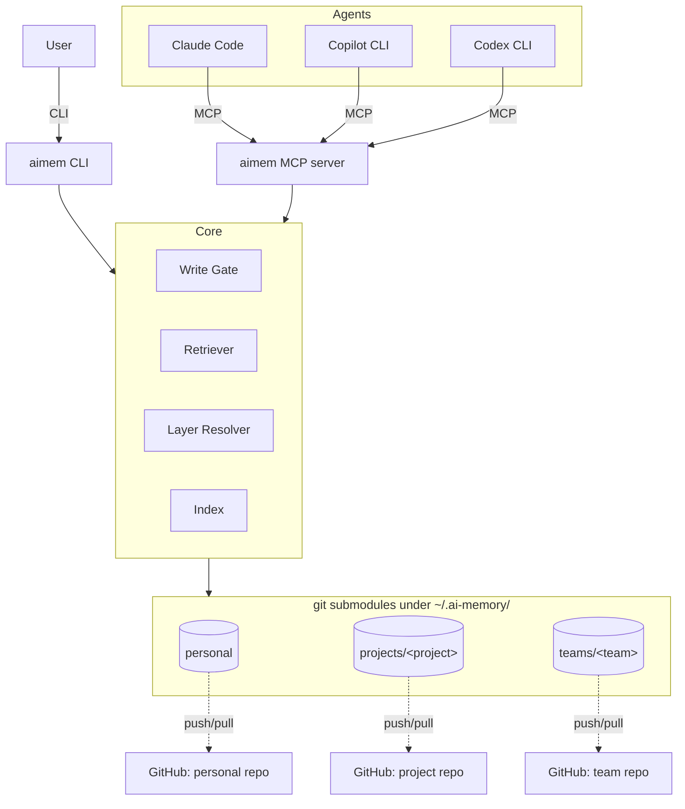

# aimem — Engineering Design

| Field | Value |
|---|---|
| Status | Draft for Phase 1 kickoff |
| Iteration | 1 (supersedes `design.2026-04-19.md`) |
| Date | 2026-05-06 |
| Evidence basis | `memory-system/ai-memory-system-design.md` (research vault, iter 8, 54 papers, validator PASS / 1.00) |
| Harness | `local-agent-harness` stage **S2**, AI-readiness **15/25** |
| Hard constraints | `../GROUNDING.md` (HC1–HC6) |

> This document is the **engineering** design for `aimem`. It is intentionally
> shorter than the research report and deliberately omits literature
> evidence — for that, read the linked research report. This document
> answers: *what are we building, what are the engineering decisions, and
> in what order?*

## 1. Goals and Non-Goals

### 1.1 Goals

1. A **local, git-based** memory system for desktop AI coding agents:
   Claude Code, GitHub Copilot CLI, and Codex CLI.
2. **Three sharing layers** with strict, mechanically-enforced isolation:
   - **personal** — private to one developer (preferences, identity).
   - **project** — shared with everyone working on the same project.
   - **team** — shared organization-wide policies and procedures.
3. **Pluggable remotes**, with GitHub as the reference remote.
4. **Local-first**: every operation works offline; sync is asynchronous.
5. **Auditable**: every memory change is a signed git commit on a branch
   the user can inspect, revert, and review.
6. **Safe-by-default**: no plaintext secrets (HC1), no writes outside the
   working tree (HC2), no agent-driven destructive ops (HC3, HC4).

### 1.2 Non-Goals (v1)

- A cloud SaaS, multi-tenant API, or hosted control plane.
- Replacing existing IDE memory features; we *adapt* into them.
- Online RL training of the retrieval policy. Phase 1 ships **deterministic
  retrieval**; the offline-RL rail (E-2) is Phase 4.
- Cross-agent state synchronization beyond memory artifacts (no shared
  prompt history, no shared tool logs).

## 2. Architecture (one screen)



The **CLI** and the **MCP server** are two front-ends over the same
`aimem.core` library. Storage is three independent git repos mounted as
submodules of a small parent index repo. Writes go through a write-gate
(content-classified, layer-checked, signed). Reads union the three layers
under an information-flow-control lattice.

For the full mechanism inventory, see research report
[§3 Architecture Overview](../../Documents/Research/memory-system/ai-memory-system-design.md#3-architecture-overview).

## 3. Three-Layer Sharing Model

This is the headline feature. See research report
[§8.1 Three-Layer Sharing Model](../../Documents/Research/memory-system/ai-memory-system-design.md#81-three-layer-sharing-model)
for evidence. Engineering decisions:

### 3.1 On-disk layout

```
~/.ai-memory/                # parent index repo (private, optional remote)
├── .aimem.yaml              # global config
├── personal/                # git submodule → personal remote
├── projects/
│   └── <project-slug>/      # git submodule → project remote (per project)
└── teams/
    └── <team-slug>/         # git submodule → team remote (per team)
```

Each layer is a **separate git repository** so that access control,
history, and remotes are independent. Submodules give us atomic
per-layer commits and lossless detach-in-place if the user drops a layer.

### 3.2 Information-flow-control lattice

`personal ⊑ project ⊑ team` (least → most public).

| Operation | Allowed without ceremony | Requires explicit promote PR |
|---|---|---|
| Read `personal` from a `project` context | yes (read-up) | — |
| Read `project` from a `personal` context | yes | — |
| Write a `personal` note | yes | — |
| Write a `team` note | — | yes; signed; reviewed |
| Promote `personal` → `project` | — | `aimem layer promote` |
| Demote `team` → `project` | — | `aimem layer demote` |

Write-down (more-private → more-public) is **never silent**: it always
opens a maintainer-reviewed PR on the receiving remote.

### 3.3 Retrieval precedence

When the same logical note appears in multiple layers (e.g. a project
override of a team default), the **more private layer wins** with a
score margin `θ_tie = 0.05`. Below that margin, the union is returned
and the agent is told both exist.

## 4. MemoryRecord schema (v1)

```yaml
# every note ends with a YAML frontmatter; body is markdown
schema_version: 1            # MUST be present; CI rejects missing
id: <ulid>                   # ULID, monotonic per process
layer: personal | project | team
type: identity | preference | procedure | observation | knowledge
title: <string>
created_at: <RFC3339>
updated_at: <RFC3339>
tags: [<string>, ...]
links:
  causal:    [<id>, ...]
  evolves:   [<id>, ...]
  refines:   [<id>, ...]
forgetting:
  ttl_days: <int|null>
  decay:    none | exponential
provenance:
  agent:   <agent-name>
  session: <session-id>
sig: <ed25519-detached-sig over the canonical serialization>
```

**Schema versioning policy**:

- `schema_version` is an integer.
- Every breaking change bumps it by 1 and ships a migrator in
  `aimem/storage/migrations/v<N>_to_v<N+1>.py`.
- `aimem migrate` is **author-only**; CI runs the migrator dry-run on
  every PR and refuses merges that would silently downgrade.
- Old records are kept verbatim with their original `schema_version`;
  the retriever projects them up at read time.

## 5. CLI surface (v1)

`aimem` is the only entry point. Subcommands ship in this order:

| Phase | Commands |
|---|---|
| 1 | `init`, `add`, `query`, `show`, `tag`, `link`, `sync`, `status` |
| 1 | `layer init`, `layer link`, `layer list`, `layer scope` |
| 2 | `layer promote`, `layer demote`, `layer share`, `inbox` |
| 2 | `forget`, `tombstone`, `verify` |
| 3 | `evolve`, `compact`, `export`, `import` |
| 4 | `policy {train,roll,shadow}` (offline RL rail) |

All commands return structured JSON when `--json` is passed; that JSON
is the contract the MCP server marshals to/from.

## 6. MCP server

Single binary, one transport, pinned version:

- **Transport**: MCP `stdio` for v1. WebSocket transport is deferred.
- **Protocol version pin**: MCP `2025-06-18`.
- **Tools**: `memory_query`, `memory_add`, `memory_link`, `memory_tag`,
  `memory_layer_list`, `memory_layer_scope`, `memory_layer_promote`,
  `memory_sync`, `memory_inbox`.
- **Resources**: `memory://record/<id>`, `memory://layer/<layer>/<path>`,
  `memory://search?q=...`, `memory://inbox`.

The server **does not** hold writes in memory across reconnects. Every
tool call is a one-shot transaction against the on-disk repo.

## 7. Storage and retrieval

- **Format**: one file per `MemoryRecord`, markdown body + YAML
  frontmatter, file path is content-addressed by `id`.
- **Index**: SQLite (FTS5) for keyword + a flat **HNSW** index for
  vectors. Index is **never committed** to git; it is rebuildable from
  the records.
- **Embeddings**: default model is **`bge-small-en-v1.5`** (384-dim,
  CPU-runnable, MIT-license). Pluggable via
  `~/.ai-memory/.aimem.yaml::embed.model`. We do not require a GPU.
- **Stale-vector handling** (research A-3): tombstone deletes; HNSW
  re-link on scheduled compaction; embedding-model upgrade triggers a
  full re-embed under a new index generation, old generation served
  read-only until the new one is warm.

## 8. Security model

Layered on top of `GROUNDING.md` (HC1–HC6, never relaxed):

- **Secrets at write time**: gitleaks pre-commit hook on every layer
  blocks plaintext secrets (HC1).
- **Write gate**: every `aimem add` runs a content classifier; "red"
  data per `GROUNDING.md` data classification table is **rejected at
  write**, never quarantined.
- **Quarantine for sync**: incoming records from a remote land in
  `<layer>/.inbox/` and are **not retrievable** until `aimem inbox
  approve`. This is research E-3.
- **Signing**: every record is signed with the user's local ed25519
  key; sync verifies signatures against the layer's known-key set.
- **DP for cross-layer leakage** (research A-4): when a record is
  promoted from `personal` to `project`, only the **summary +
  embedding** cross the boundary, with Gaussian-mechanism noise; the
  raw text never crosses. Privacy budget tracked in
  `~/.ai-memory/.privacy/budget.json`.
- **Adaptive-attack robustness** (research A-2): HarmBench + PAIR + TAP
  red-team protocol is a **release blocker for multi-tenant team
  layers**. Single-user personal layer ships in Phase 1 without it.

## 9. Evaluation gates (release-blocking)

| Gate | What it measures | Blocks |
|---|---|---|
| `aimem verify` | Schema validity, signature validity, no orphan links | every commit |
| LayerEval (research §15.4) | Cross-layer leakage rate, precedence correctness, cascade-delete purity | every release |
| LongMemEval slice | Retrieval P@5 ≥ 0.7 on bundled fixture | every release |
| RedTeam suite (A-2) | HarmBench + PAIR + TAP attack success rate ≤ 5 % | **multi-tenant team release only** |
| Latency budget | see §10 | every release |

## 10. Performance budget (per command, p95, on a 2024 laptop)

| Command | Budget |
|---|---|
| `aimem query` (≤ 5 results, all 3 layers, warm index) | 150 ms |
| `aimem add` (single record, no sync) | 200 ms |
| `aimem sync` (one layer, no conflicts) | 2 s |
| MCP `memory_query` round-trip | 200 ms |
| Cold-start (first command in a process) | 1.5 s |

These are **engineering targets**, not research claims. They drive the
choice of bge-small (cheap on CPU), SQLite FTS5 (no daemon), and HNSW
flat (no GPU).

## 11. Logging and error taxonomy

- **Logs**: structured JSON lines under `.agent/logs/aimem.jsonl`;
  rotated daily; never committed (see `.gitignore`).
- **Log fields**: `ts, level, op, layer, record_id, latency_ms,
  agent, session, error.code, error.kind`.
- **Error kinds** (stable contract for the MCP layer):

  | kind | meaning | retriable |
  |---|---|---|
  | `config` | bad/missing `.aimem.yaml` field | no |
  | `auth` | signature, key, or remote-auth failure | no |
  | `conflict` | git merge conflict during sync | yes (after resolve) |
  | `quarantine` | inbox entry not yet approved | no |
  | `not_found` | record/layer/tag missing | no |
  | `invariant` | schema or IFC violation | no |
  | `transient` | I/O, network, or timeout | yes |

- **Redaction**: error messages MUST NOT contain note bodies; only IDs,
  paths relative to repo root, and error kinds.

## 12. Roadmap (mapped to research §18)

| Phase | Scope | Exit criteria |
|---|---|---|
| 1 — Local single-layer | personal layer only, CLI, MCP, deterministic retrieval | `aimem verify` green; LongMemEval slice passes; idempotent harness |
| 2 — Three layers | project + team layers, IFC enforcement, inbox quarantine, write-gate classifier | LayerEval green; A-3 tombstone tests green |
| 3 — Sync hardening | conflict-resolution UX, signed sync, DP on promote | A-4 DP accountant in place; quarantine dogfooded |
| 4 — Policy upgrade | offline-RL retrieval policy (E-2) shadowed against deterministic baseline | divergence < 1 %, SR@1 strictly improves |
| 5 — Multi-tenant team release | A-2 red-team protocol numbers landed; key-rotation playbook; team onboarding doc | RedTeam ASR ≤ 5 % |

Phase boundaries are also `git tag`s.

## 13. Open engineering questions deferred past v1

- Default **evaluator LLM** for the `evolve`/`compact` step. Candidates:
  local Llama-3.1-8B-Instruct (offline-friendly) vs. user-provided API
  key. Decision: ship both, default to local; flag in
  `~/.ai-memory/.aimem.yaml::evolve.model`.
- Submodule **bootstrap UX**: today `git submodule add` requires the user
  to know each layer's remote URL. Phase 2 adds `aimem layer link <url>`
  that wraps `git submodule add` + initial sign-off.
- **CRDT engine** for OR-Set semantics (research A-5): hand-rolled in
  Phase 2; consider extracting to a separate crate/library in Phase 4 if
  reuse is needed.

## 14. References

- Research report (evidence basis):
  `~/Documents/Research/memory-system/ai-memory-system-design.md` (iter 8,
  PASS / 1.00).
- Hard constraints: `../GROUNDING.md`.
- Agent contract: `../AGENTS.md`.
- Snapshot of pre-iter-8 design (April 19): `./design.2026-04-19.md`.
